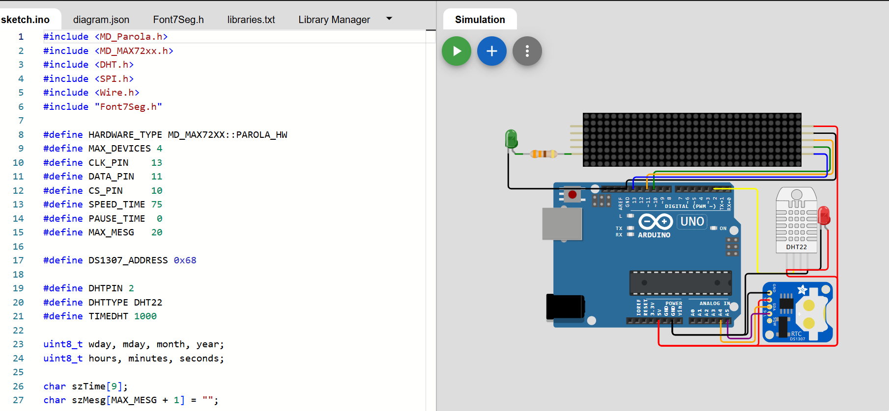
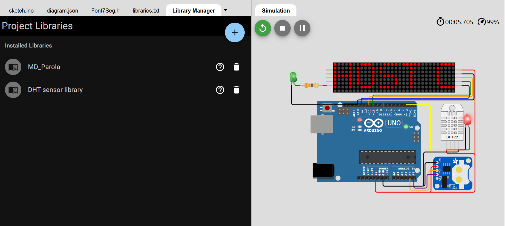

 

> Arr CyberFullstackDeveloperArr

|  **Penjelasan**             |
|---------------------|
| 
Proyek Wokwi ini adalah skematik untuk sebuah sistem IoT menggunakan Arduino Uno. Sistem ini terdiri dari beberapa komponen: MAX7219 LED matrix, DS1307 RTC, DHT22 sensor suhu dan kelembapan, serta dua LED. MAX7219 dihubungkan ke Arduino melalui pin 10, 11, dan 13 untuk CS, DIN, dan CLK. DS1307 terhubung ke pin A4 dan A5 untuk SDA dan SCL, sementara DHT22 terhubung ke pin 2. LED hijau dan merah dihubungkan ke DHT22 untuk indikator status, dengan LED hijau juga terhubung ke resistor 330 ohm. Koneksi daya dan ground diatur untuk semua komponen agar sistem berfungsi dengan baik.
 |

> WOKWI
